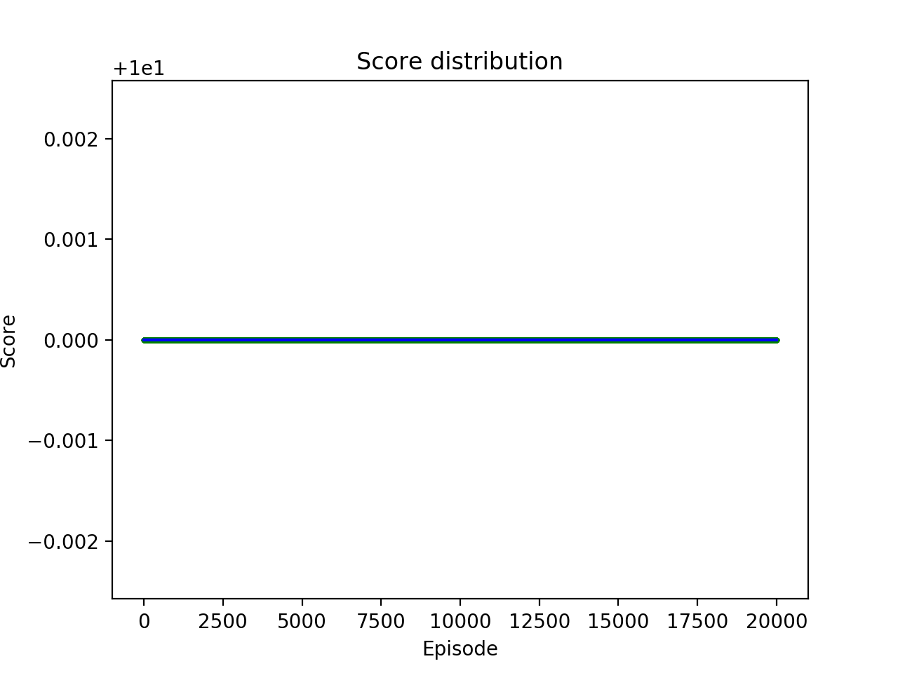
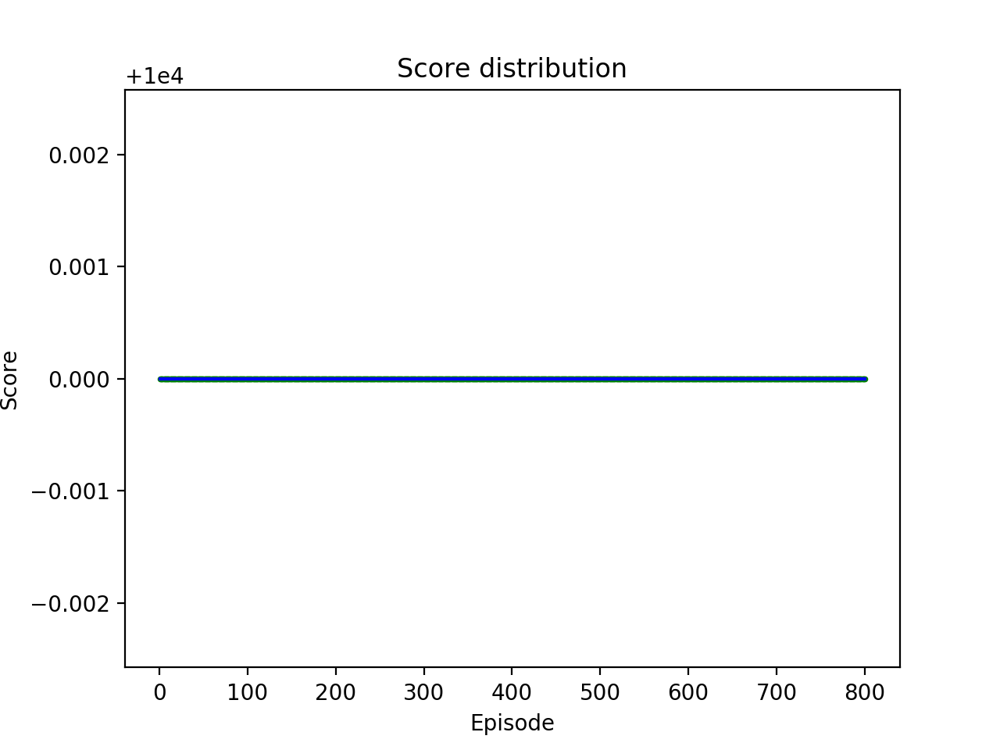

# Use reinforcement learning to train a flappy bird which NEVER dies  


---

## Dependency

Install **pygame==1.9.6** package first  
Install **python3**

---

## File Structure

- `src/bot.py` - This file contains the `Bot` class that applies the Q-Learning logic to the game.

- `src/flappy.py` - Main program file in python, play the game or train an agent to play the game
- `data/qvalues.json` - Q-table of state-actions in Q-Learning, start a new training by removing this file
- `data/hitmasks_data.pkl` - Mask data to detect crash in non-UI training mode

---

## How to run

``` dos
python3 src/flappy.py [-h] [--fps FPS] [--episode EPISODE] [--ai]
                      [--train {normal,noui,replay}] [--max MAX]
                      [--dump_hitmasks]
```

- `-h, --help` : Show usage formation
- `--fps FPS` : number of frames per second, default value:
  - User play or normal training mode with UI: `25`
  - Replay training mode: `20`
  - AI play mode: `60`
- `--episode EPISODE` : Training episode number, default: 10,000
- `--ai` : AI play mode
- `--train {normal,noui,replay}` : Training mode:
  - `normal` : Normal training mode with UI
  - `noui` : Training without UI, fastest training mode
  - `replay` : Training without UI, replay game with UI from last 50 steps once the bird crashes, it provides a visual way to check how bird crashed.
- `--max MAX` : Maxium score per episode, restart game if agent reach this score, default: 10,000,000
- `--dump_hitmasks` : dump hitmasks to file and exit

### Play game in user mode

``` dos
python3 src/flappy.py
```

### Train the agent bot without UI, play 1000 times

``` dos
python3 src/flappy.py --train noui --episode 1000
```

### Train the agent bot without UI, replay last 50 steps before crash, restart game when the bird reach 1000 scores

``` dos
python3 src/flappy.py --train replay --episode 1000 --max 1000
```

---

## What I've done

After long time training (10+ hours), I ran another test with **Max Score=10M** and **Episode=2**. The game will restart once the bird reaches 10M score. This test demostrates the trained agent can fly for a long time without any crash. Even training without UI, it still need almost 2 hours in my Mac to reach 10M scores. I only run 2 episodes in this test.

<br>
`Total episode: 2, Max score: 10,000,000`  

From start point to the first pipe, the bird will fly a long distance without any obstacles, the states before the first pipe won't be same as the following training, the next test demostrates the trained agent deals with the beginning of the journey perfectly. Setting **Max Score=10** and **Episode=20,000**, the agent passed the test without any failure.

<br>
`Total episode: 20,000, Max score: 10`  

The 3rd test demostrates the stability and reproducibility for any of the game. In this test, **Max Score=10,000** and **Episode=800**, the trained agent also passed without any failure.  

<br>
`Total episode: 800, Max score: 10,000`  

I did additional test to see how many score the bird could fly, just for curious. I set **Max Score=50,000,000** for only **One Episode**.  


## Conclusion

**The trained agent(flappy bird) NEVER dies.**

---

## Background

To be updated

## How to improve

To be updated

## References

https://github.com/chncyhn/flappybird-qlearning-bot  
https://github.com/sourabhv/FlapPyBird
