# Use reinforcement learning to train a flappy bird which NEVER dies  

### [Use reinforcement learning to train a flappy bird NEVER to die](https://towardsdatascience.com/use-reinforcement-learning-to-train-a-flappy-bird-never-to-die-35b9625aaecc)

### [Video](https://youtu.be/PZ5YEKlKz80)  


---

## Dependencies

Install **pygame 1.9.6** package first  
Install **python 3.7**

---

## File Structure

- `src/bot.py` - This file contains the `Bot` class that applies the Q-Learning logic to the game.

- `src/flappy.py` - Main program file in python, play the game or train an agent to play the game

- `data/qvalues.json` - Q-table of state-actions in Q-Learning, start a new training by removing this file

- `data/hitmasks_data.pkl` - Mask data to detect crash in non-UI training mode

---

## How to Run

``` dos
python3 src/flappy.py [-h] [--fps FPS] [--episode EPISODE] [--ai]
                      [--train {normal,noui,replay}] [--resume]
                      [--max MAX] [--dump_hitmasks]
```

- `-h, --help` : Show usage formation
- `--fps FPS` : number of frames per second, default value:
  - User play or normal training mode with UI: `25`
  - Replay training mode: `20`
  - AI play mode: `60`
- `--episode EPISODE` : Training episode number, default: 10,000
- `--ai` : AI play mode
- `--train {normal,noui,replay}` : Training mode:
  - `normal` : Normal training mode with UI
  - `noui` : Training without UI, fastest training mode
  - `replay` : Training without UI, replay game with UI from last 50 steps once the bird crashes, it provides a visual way to check how bird crashed.
- `--resume` : Resume game from last 50 steps before crash, it's useful to correct flying trajectory for rare scenario. But it's 3x slower than normal mode. When in replay training mode, this option is enabled automatically.  
- `--max MAX` : Maxium score per episode, restart game if agent reach this score, default: 10,000,000
- `--dump_hitmasks` : dump hitmasks to file and exit

### Play game in user mode

``` dos
python3 src/flappy.py
```

### Train the agent bot without UI, play 1000 times

``` dos
python3 src/flappy.py --train noui --episode 1000
```

### Train the agent bot, replay last 50 steps before crash with UI, restart a new game when the bird reach 1000 scores

``` dos
python3 src/flappy.py --train replay --episode 1000 --max 1000
```

---

## Achievements

After long time training (10+ hours), I ran validation test with **Max Score=10M** and **Episode=2**. The game will restart once the bird reaches 10M score. This test demonstrates the trained agent can fly for a long time without any crash. Even training without UI, it still need almost 2 hours in my Mac to reach 10M scores. I only run 2 episodes in this test.

<p align="center">
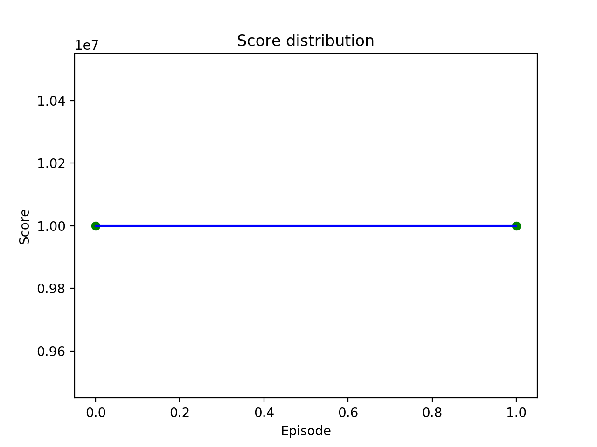&nbsp; &nbsp;
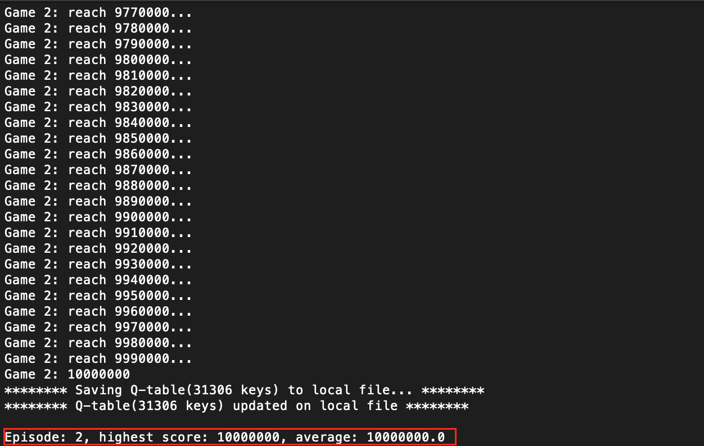<br>
<b>Total episode: 2, Max score: 10,000,000</b></p>  

From start point to the first pipe, the bird will fly a long distance without any obstacles, the states before the first pipe won't be same as the following training, the next test demonstrates the trained agent deals with the beginning of the journey perfectly. Setting **Max Score=10** and **Episode=100,000**, the agent passed the test without any failure.

<p align="center">
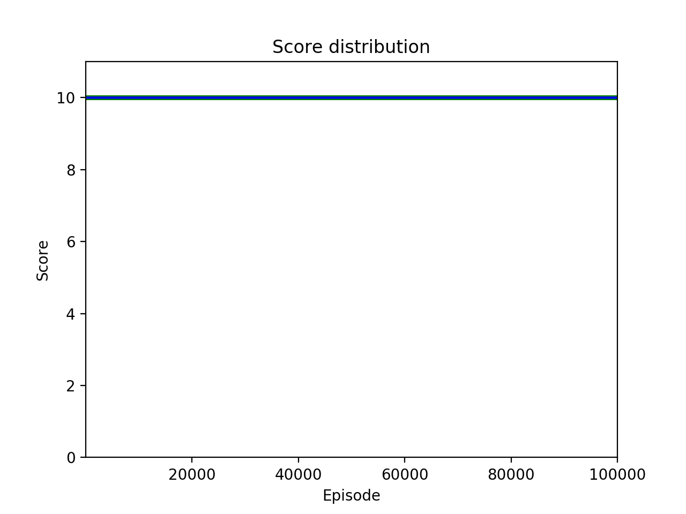&nbsp; &nbsp;
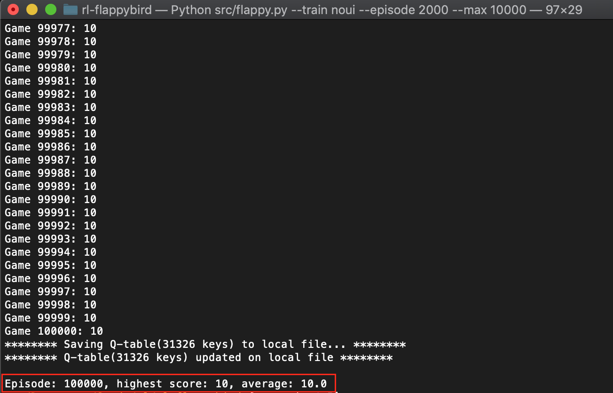<br>
<b>Total episode: 100,000, Max score: 10</b></p>  

The 3rd test demonstrates the stability and reproducibility for any of the game. In this test, **Max Score=10,000** and **Episode=2,000**, the trained agent also passed without any failure.  

<p align="center">
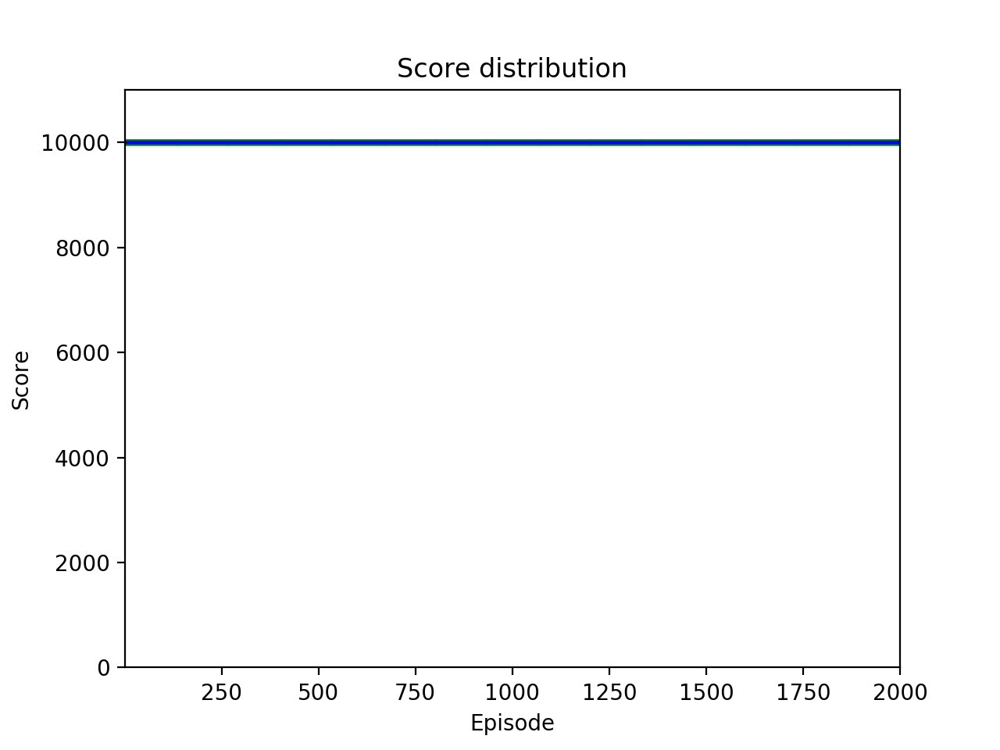&nbsp; &nbsp;
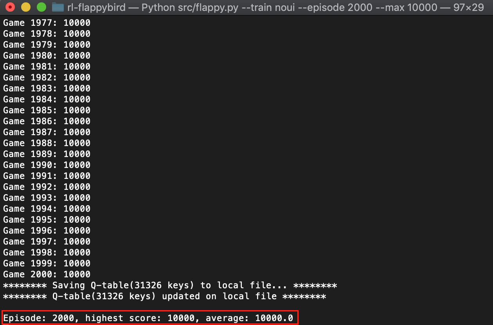<br>
<b>Total episode: 2,000, Max score: 10,000</b></p>

I did final test to see how many score the bird could fly, just for curious. I set **Max Score=50,000,000** for only **One Episode**.  

<p align="center">
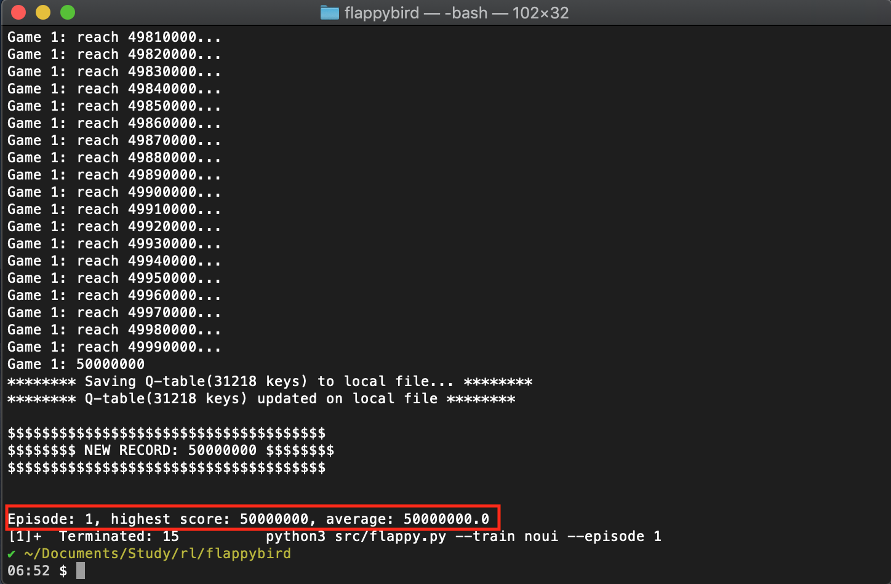</p>

## Conclusion

**The trained agent(flappy bird) NEVER dies.**

---

## Background

Thanks [Cihan Ceyhan](https://github.com/chncyhn/flappybird-qlearning-bot) for providing a good example to start with. And much appreciated of [Sarvagya Vaish](https://github.com/SarvagyaVaish) explaining the theory in details [here](https://sarvagyavaish.github.io/FlappyBirdRL/).

In [Cihan Ceyhan](https://github.com/chncyhn/flappybird-qlearning-bot)'s code, the trained agent can reach over 5000 scores as following:

<p align="center">
<br>
<a href="https://github.com/chncyhn/flappybird-qlearning-bot">Source: Flappy Bird Bot using Reinforcement Learning</a>
</p>  

However, as you can see, the bird can't reach a high score in each game, it may crash at any score. It's not stable enough.

### Is it possible to train a bird never to die in any game?

---

## How to Improve

### State Space

In [Sarvagya](https://github.com/SarvagyaVaish)'s post, he defined three dimensions to represent one state:  

- **X** - Horizontal distance to next pipe
- **Y** - Vertical distance to next pipe
- **V** - Current velocity of the bird

In [Cihan Ceyhan](https://github.com/chncyhn/flappybird-qlearning-bot)'s code, if bird enters tunnel more than 30 pixels(pipe width=52px), the bird will move the eyes to next pipe. However, it may cause conflict result to the Q-table. For the same X, Y, V(to the next pipe), if the bird's current position is close to the edge part of current pipe(in red), the bird may crash in the tunnel which is transparent to the bird at that time.

<p align="center">
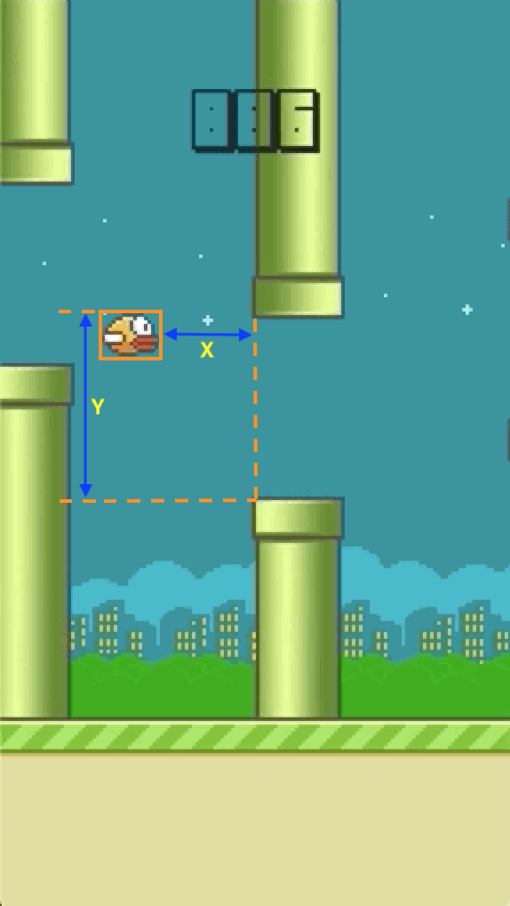&nbsp; &nbsp; &nbsp; &nbsp; &nbsp; &nbsp; &nbsp; &nbsp;  
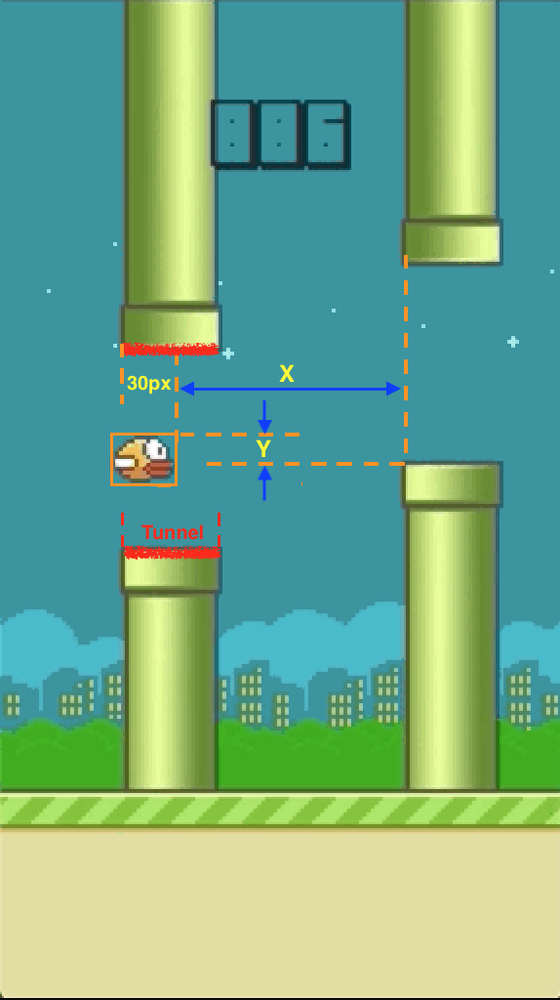
</p>

I added the 4th dimension in the state:

- **`Y1`** - the vertical distance between next two pipes, it helps bird to take action in advance according to the height difference of two consecutive pipes. This value is only used when the bird enters the tunnel part. It can reduce the state space.

Furthermore, the bird still can perceive the current pipe until 50 pixels long in the tunnel. After that, the bird almost flies out of the tunnel. The pipe just passed can't impact the bird any longer. It's time to focus on next pipe.

<p align="center">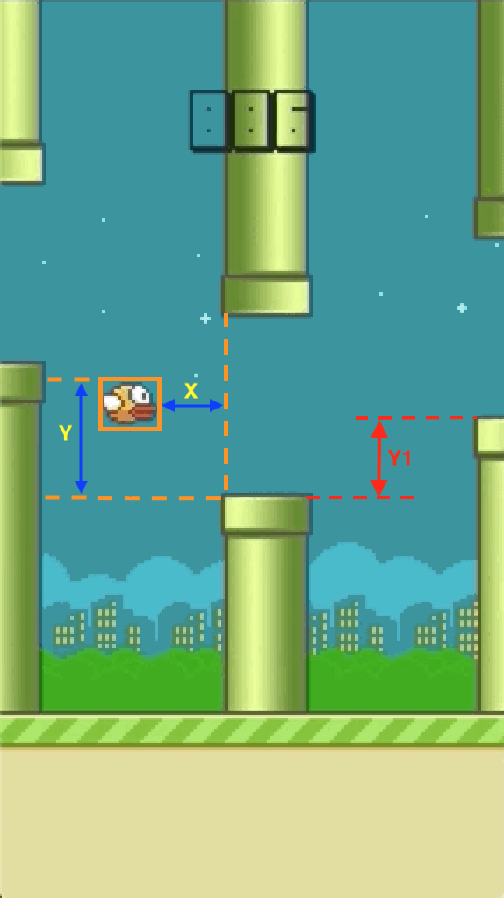</p>

### Rewards in Q-learning  

With the above improvement, the bird can easily fly to 10000 scores. However, it's still not stable, there are many failures before reaching 10000 scores.

As explained by [Sarvagya](https://github.com/SarvagyaVaish), the bot gets **+1** reward of alive for each step, while gets **-1000** reward if dead. It works well in most scenarios.

Let's look at the following scenario. The next pipe has a huge drop from the previous one, the maximum vertical drop is 142px between two pipes in the game. Considering the bird is in the position showing in the example, if the bird is falling and want to pass through these two pipes successfully, it may take *route 1* or *route 2*, but neither of them can go through the next pipe successfully. It may work in most of scenarios if the vertical difference doesn't not reach the maximum drop. Refer to the right screenshot.

<p align="center">
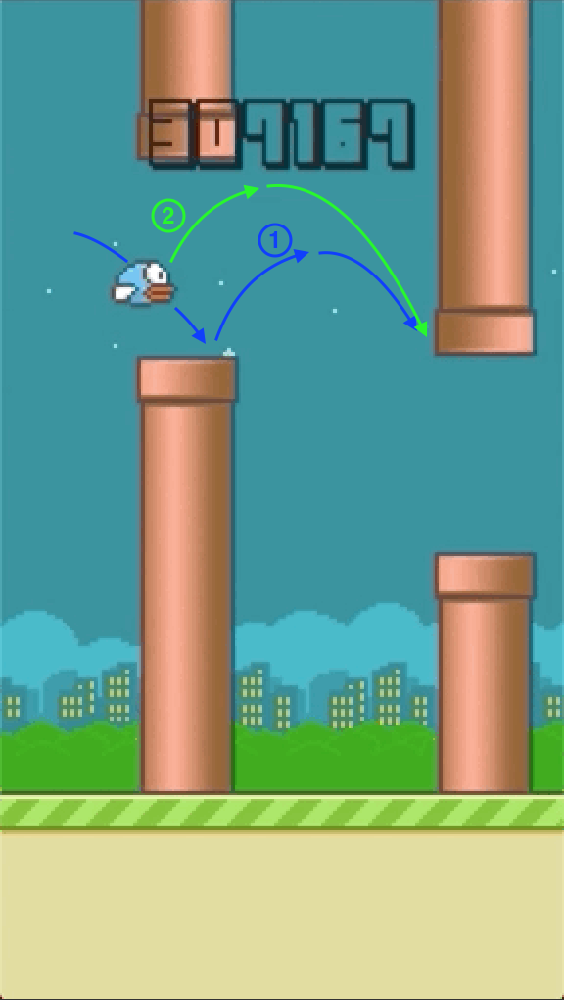&nbsp; &nbsp; &nbsp; &nbsp; &nbsp; &nbsp; &nbsp; &nbsp;  
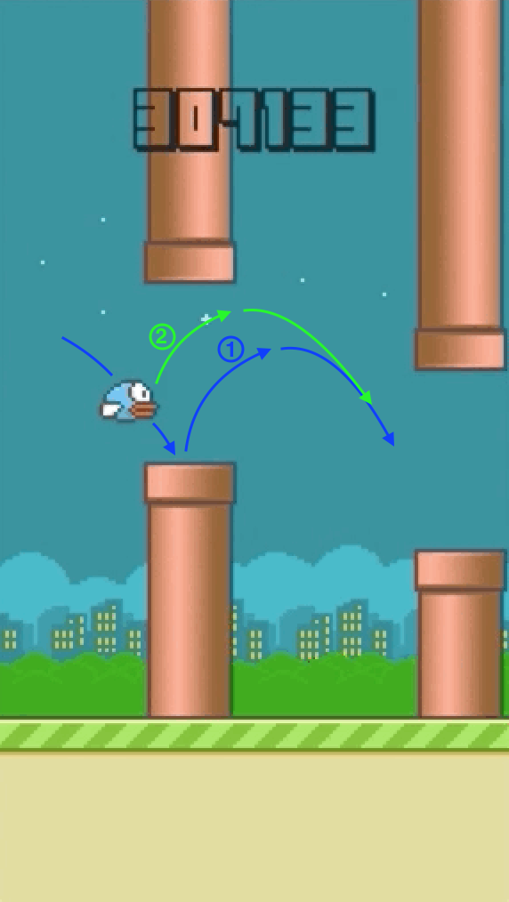
</p>

We train the bird for million of times, and the bird accumulates a large number of positive value of that position. The worst case is a quite low-occurrence event, even there is once a case leading to crash, **it only minus 1000 rewards**. The remaining value is still a big positive value or the bird can easily to gain another 1000 rewards from successful training sessions. So the bird will crash again once it encounters the similar situation.

**`I changed the reward of alive from 1 to 0`**, it forces the bird to focus on the long term alive, to keep away from any action causing death. It will get penalty of -1000 rewards on death no matter how many successful sessions the bird ran in the past.

**After this improvement, it greatly increases the stability.**

### Resume Game from Death

It's rare chance to encounter the worst cases. In other words, the bird doesn't have enough training sessions on these cases. It may encounter once, but next time, it won't encounter the similar scenario. It may take a long time to happen again.

It's not ideal for training. I recorded the last 50 steps of the bird journey in real time, **`the game can resume from the last 50 steps before the crash`**. It's a great help to traverse all the possible states in a short time.

Let's take the previous case as an example. The bird is in the falling state when entering the tunnel, no matter it takes *route 1* or *route 2* or any other route, it may still crash on next pipe. The game restarts from this point, it may try other action and dies. Restart game again until the bird finds it shall be in a rising state to enter this case. Then it can go through any scenario including worst case.

<p align="center">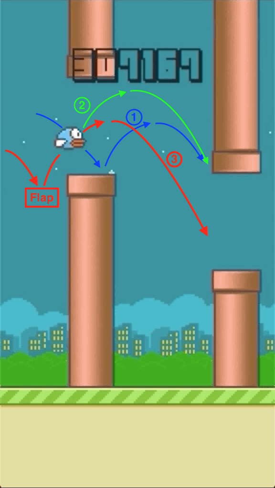</p>

### Memory Issue

In `Bot` class, it saves state information for each movement which is used to update Q-table once the bird dies.

It consumes a lot of memory when bird reaches several millions scores. It also slows down the training speed.

<p align="center">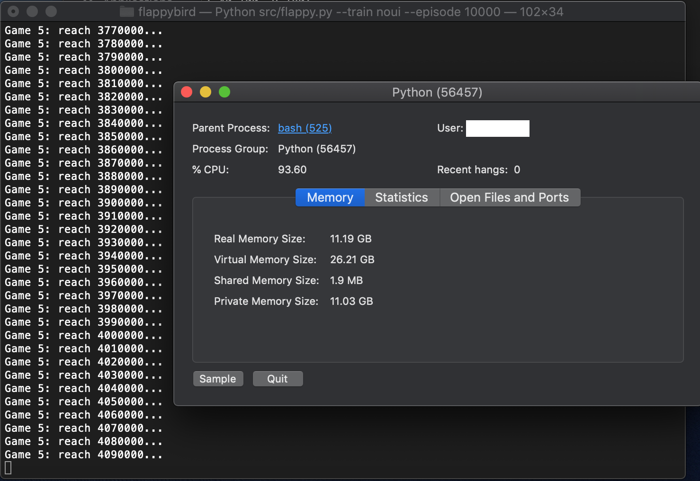</p>

Every 5 million steps which equivalent to around 139,000 of scores, I update Q-table then reduce the array list. I still leave 1 million steps buffer to avoid impact to the bird in case the bird crash right after 6 million steps.

```python
def save_qvalues(self):
    if len(self.moves) > 6_000_000:
        history = list(reversed(self.moves[:5_000_000]))
        for exp in history:
            state, act, new_state = exp
            self.qvalues[state][act] = (1-self.lr) * self.qvalues[state][act] + self.lr * ( self.r[0] + self.discount*max(self.qvalues[new_state][0:2]) )
        self.moves = self.moves[5_000_000:]
```

After the change, the maximum memory consumption is around 1GB, much less than before.

<p align="center"></p>

### Q-table Initialization

In the original solution, it need a separate step to initialize the q-table and it also includes a lot of states which the bird never experience.

In my solution, the state is only initialized if the bird experiences a new state. So Q-table only contains the states which the bird ever experienced. And it doesn't need a separate step to initialize the Q-table first.

To start a new training from scratch, it only needs remove the `qvalues.json` file under `data/` folder.

---

## Steps to Train a Bird Which Never Dies

1. Set **Max score = 10K**, **Episode = 15K**, enable **resume** mode

``` dos
python3 src/flappy.py --train noui --episode 15000 --max 10000 --resume
```

<p align="center">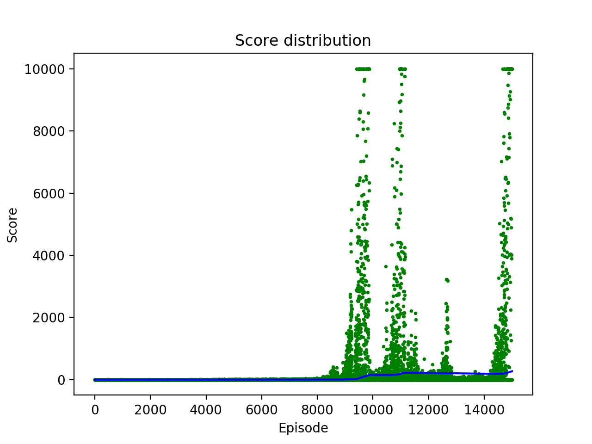</p>  

2. Set **Max score = 10**, **Episode = 15K**, enable **resume** mode

``` dos
python3 src/flappy.py --train noui --episode 15000 --max 10 --resume
```

<p align="center"></p>  

3. Repeat *`step 1`* and *`step 2`* alternatively until almost all the episodes end at desired maximum scores.

<p align="center">
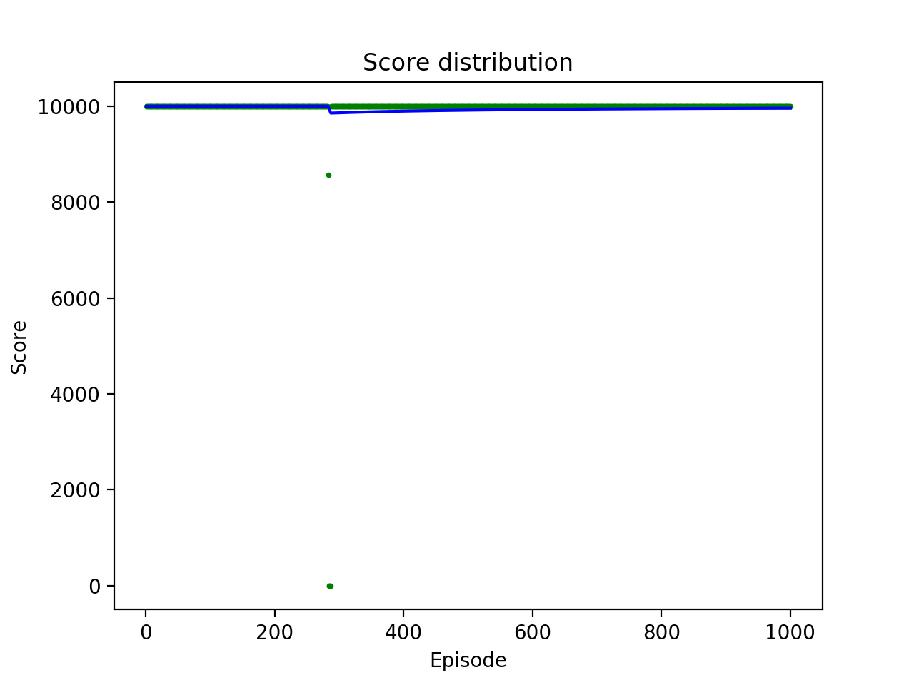
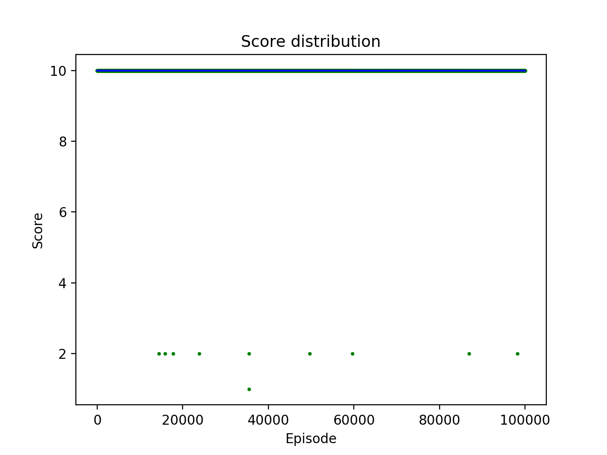
</p>

4. Set higher **Max score = 10M**, **Episode = 1000**, enable **resume** mode, until it can reach 10M maximum score.

``` dos
python3 src/flappy.py --train noui --episode 1000 --resume
```

<p align="center">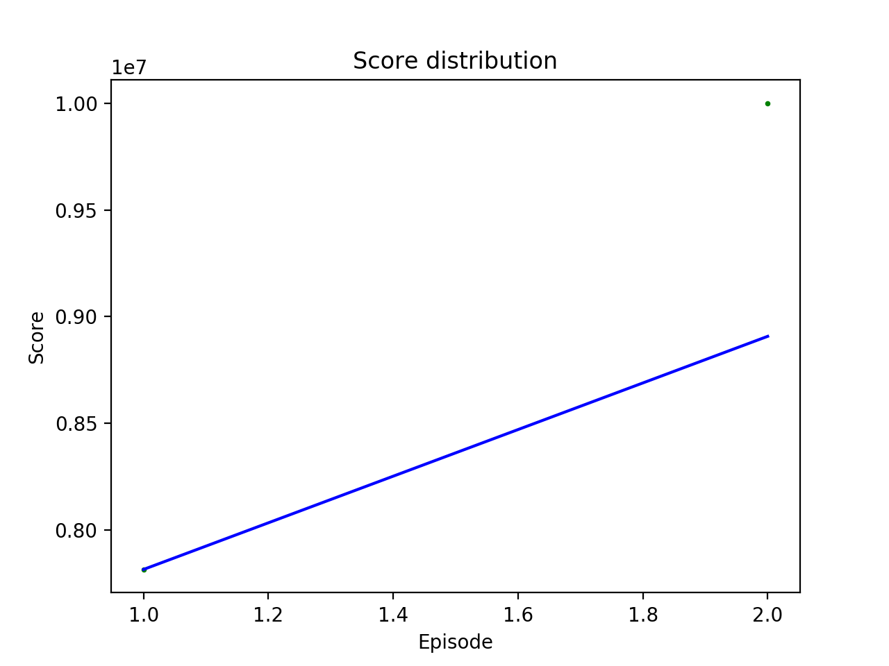</p>  

5. It may take 10+ hours to train a bird to a perfect state from scratch. Validate the AI bot without **resume** option, it will 3x faster. It costs about 2 hours to reach 10M scores in my Mac. If bird still encounters crash at the beginning phase, try to train more episodes in *`step 2`*. If bird crashes in the latter phase, try to train more in *`step 1`*.

---

## References

http://sarvagyavaish.github.io/FlappyBirdRL/  
https://github.com/chncyhn/flappybird-qlearning-bot  
https://github.com/sourabhv/FlapPyBird  

